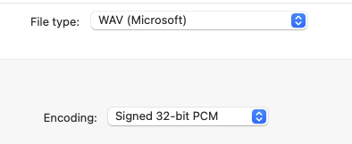
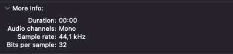
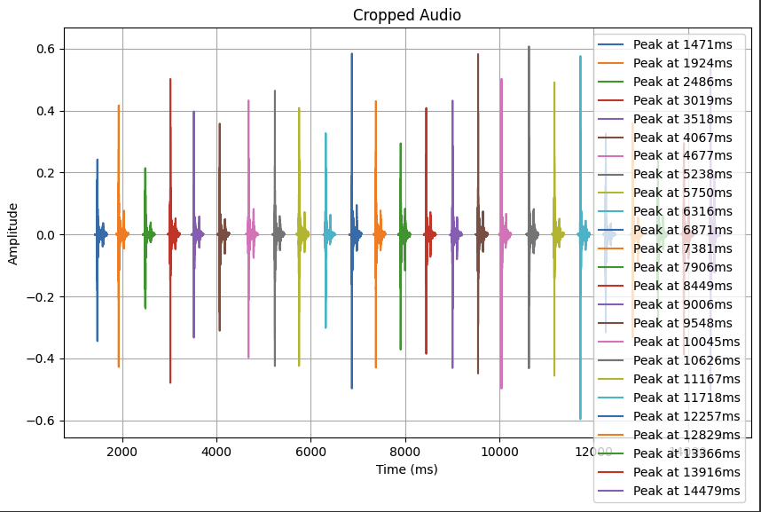
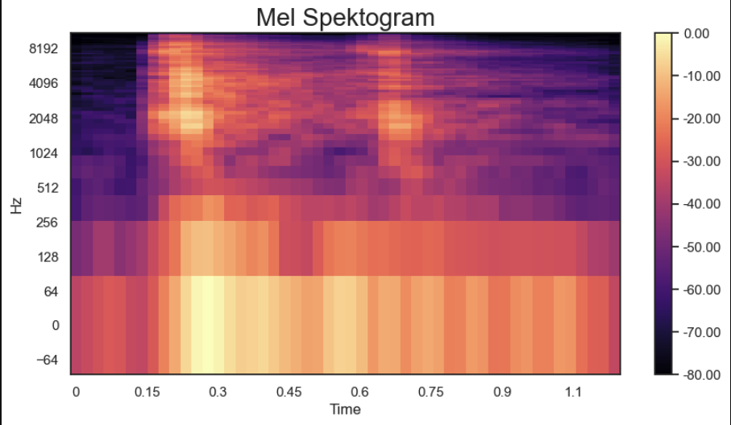
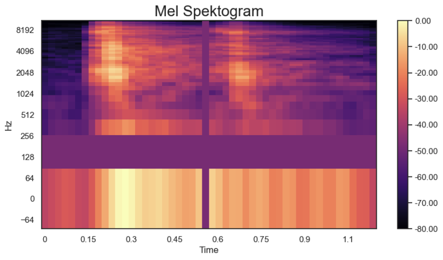

# Automated Acoustic Side-Channel Attack on Keyboard Inputs via Combined Video–Audio Analysis

[](https://colab.research.google.com/github/k3rnel-pan1c-ksd/automated-keystroke-acoustic-attack/blob/main/ZnanstveniRad_final.ipynb)

Dario Vranješ, Ivo Stančić, Toni Perković, Marin Bugarić
Faculty of Electrical Engineering, Mechanical Engineering and Naval Architecture (FESB), University of Split, Croatia

This repository releases the code, trained models, and labelled datasets for an
acoustic side-channel attack (ASCA) on keyboard input. Its core contribution is an
**automated OCR-aligned labelling pipeline**: video frames are processed with optical
character recognition (OCR) to recover the typed ground-truth character sequence, the
audio track is segmented into clips centred on detected keystroke clicks, and the two
streams are aligned. A convolutional neural network (CNN) trained on mel-spectrogram
features then classifies keystrokes, and **transfer learning** adapts the pretrained
model to a new user/session with only a handful of samples.

On a held-out test set the base CNN reaches **98.1% top-1, 99.4% top-2 and 100% top-3**
accuracy over 50 unique QWERTZ keys recorded during real programming lectures. Transfer
learning retains strong performance with as few as **13 samples per key**.

## README

The text below describes each phase of the process. Most of it is also used in the
accompanying scientific paper.

### Threat model

The adversary observes both (i) the screen of the target machine and (ii) the
corresponding audio during a typing session — exactly the conditions of an online
lecture, a screen-shared meeting, or a publicly-streamed tutorial. No physical
proximity, hidden microphone, or software installation on the victim's device is
required; audio is captured via an ordinary laptop microphone and may pass through
conferencing compression/denoising. The OCR stream is used **only** to produce
ground-truth labels for training the acoustic classifier — not as the primary
inference signal — which is what distinguishes this work from purely video-based
keystroke inference.

Keys requiring modifier chords (e.g. Shift+letter) are not enumerated separately in
the training alphabet; uppercase/symbol handling is left to future work.

### Inputs

Audio was recorded with Audacity at **44.1 kHz** and exported as **32-bit PCM** `.wav`.
For each lecture, a synchronised screen capture and audio file were captured.


### Key detection and isolation

Each signal is first normalised to **unit RMS** amplitude to reduce volume variance.
Following *Don't Skype & Type!*, we compute the STFT over **10 ms** windows and sum the
magnitude spectra to obtain an energy envelope. A press event is detected whenever the
energy exceeds a threshold, and the subsequent **100 ms** of audio is extracted as the
keystroke waveform (shortened when keystrokes are closely spaced, to avoid overlap).
Each cropped keystroke is stored as an individual file.

> Reference (*Don't Skype & Type!*): "we first normalize the amplitude of the signal to
> have root mean square of 1. We then sum up the FFT coefficients over small windows of
> 10ms... We detect a press event when the energy of a window is above a certain
> threshold. We then extract the subsequent 100ms as the waveform of the given keystroke."

Expected detection/output form:



This yields **two datasets**:

| Dataset | Samples/key | Purpose | Path in repo |
| --- | --- | --- | --- |
| Base (generalised) | 125 | Pretrain the base model | `cropped_base/` |
| Target (user/session) | 25 | Transfer-learning + grid search | regenerated to `input_sounds_cropped/` |

### Automatic labelling (OCR alignment)

The typed character sequence is recovered by running OCR over the recorded video frames
and is aligned with the detected click events in the audio, producing large labelled
keystroke datasets with minimal manual effort. This removes the manual-annotation
bottleneck that has limited the scalability and reproducibility of previous ASCAs.

### Practical demo — automatic labelling in the browser

🔗 **Try it live: [auto-key-practical.vercel.app](https://auto-key-practical.vercel.app/)**

Conventionally, building a keystroke-acoustic dataset means **manually pairing every
keystroke sound with the key that produced it** — listening to a recording and
hand-labelling each click, one by one. This is slow, error-prone, and the main reason
previous attacks could not scale.

We replace that manual step with an **automatic labelling process**: the tool detects
each click in the audio, recovers the typed characters from the video via OCR, and
aligns the two streams so that every isolated keystroke sound is automatically tagged
with its ground-truth key — no manual annotation required. The web demo lets you run
this end-to-end and watch the keystrokes get detected, segmented and labelled
automatically, illustrating the data-collection pipeline that feeds the CNN training in
this repository.

### Feature extraction

Each cropped keystroke is converted to a **log-mel spectrogram**. MFCCs were rejected
because removing frequencies risks discarding relevant non-speech information; the raw
mel-spectrogram is retained instead.

| Parameter | Value |
| --- | --- |
| Mel bands | 64 |
| FFT window size | 1024 |
| Hop length | 225 |

```python
def extract_features(file_name):
    audio_signal, sample_rate = librosa.load(file_name, sr=None)
    mel_spec = librosa.feature.melspectrogram(
        y=audio_signal, sr=sample_rate,
        n_fft=1024, hop_length=225, n_mels=64)
    return librosa.power_to_db(mel_spec, ref=np.max)
```


**SpecAugment** is used as data augmentation: a random band of the time axis and a random
band of the frequency axis are set to the spectrogram mean ("blocking out" part of the
image), encouraging the model to generalise.

```python
def spec_augment(mel_spectrogram):
    num_freqs, num_frames = mel_spectrogram.shape
    mean_value = mel_spectrogram.mean()
    f0 = np.random.randint(0, num_freqs)   # frequency mask
    mel_spectrogram[f0:f0 + 1, :] = mean_value
    t0 = np.random.randint(0, num_frames)  # time mask
    mel_spectrogram[:, t0:t0 + 1] = mean_value
    return mel_spectrogram
```


### CNN architecture

The network operates directly on mel-spectrograms with a **factored convolutional**
design. Each block first applies a `3 × 3` convolution to capture local time–frequency
patterns, followed by `3 × 1` and `1 × 3` convolutions that decouple temporal and
spectral feature learning. All conv layers use ReLU and `same` padding; bias terms are
omitted in the early layers. A `(2 × 1)` max-pooling reduces temporal resolution while
preserving frequency resolution. The second block increases filters to capture more
abstract features. After the convolutional stages: dropout (0.2) → flatten → dense
(ReLU) → batch normalisation → dropout (0.4) → softmax. Optimisation uses **Adam** with
categorical cross-entropy.

### Hyperparameter search and model selection

A grid search (54 configurations) explored:

| Parameter | Values |
| --- | --- |
| Filters (f1, f2) | (32,64), (64,64), (64,128) |
| Dense units | 128, 256 |
| Dropout (conv.) | 0.2 (fixed) |
| Dropout (dense) | 0.2, 0.3, 0.4 |
| Learning rate | 1e-3, 3e-4, 1e-4 |

Configurations are ranked by **validation macro-F1**. Balancing validation performance
and test generalisation, the paper adopts **configuration 13** — filters `(32,64)`,
256 dense units, dense dropout `0.4`, learning rate `1e-3` — for all subsequent
experiments (a deliberate choice over the marginally higher-F1 but larger grid winner).

### Model training

The data is partitioned **80% train / 10% validation / 10% test**, with the test set kept
completely unseen during development. Labels are label-encoded then one-hot encoded.
**Stratified five-fold cross-validation** is run on the combined train+validation data
(50 epochs, batch size 32, Adam lr 1e-3; the lowest-validation-loss model per fold is
retained). A fixed random seed (42) is used for shuffling, splitting and weight
initialisation. A final model is then trained on the full train+validation set and
evaluated once on the held-out test set.

Software stack: Python 3.10, TensorFlow 2.15, NumPy 1.26, librosa 0.10, scikit-learn 1.3.
Training ran on a MacBook Pro (Apple M2, 8 GB RAM, no GPU); a full 50-epoch run takes
under 2 minutes, ~8 minutes including five-fold CV and final retraining.

### Evaluation

Performance is reported with **top-k accuracy (k = 1–5)**, **macro-averaged F1**, and
**entropy-based metrics** (entropy reduction relative to a uniform prior over the
classes, quantifying how sharply the classifier commits to a single key).

The base model (125 samples/key) is an **idealised upper-bound reference** — a large,
homogeneous, single-session dataset — and yields very high accuracy by design:

| Metric | Top-1 | Top-2 | Top-3 |
| --- | --- | --- | --- |
| Base model (held-out test) | 98.1% | 99.4% | 100% |

### Transfer learning

For realistic, data-constrained attacks, a pretrained convolutional feature extractor is
**frozen** and only a compact classification head is retrained on the target dataset.
The adapted model has ~6.63M parameters of which only ~22,575 (<1%) are trainable, which
sharply reduces overfitting. Retraining (50 epochs, Adam) converges in under a minute.
With only **13 samples per key**, the adapted model already reaches ~85% top-1, ~95%
top-3 and ~99% top-5 on the held-out test set, with early saturation thereafter.

### Test on unseen data

The pipeline is demonstrated end-to-end on the unseen keystroke sequence
`diplomski123@`. The unseen clip is classified with the **transfer model** (whose 47-key
alphabet matches typed text), not the base model.

## Repository contents / how to run

The full analysis is provided as a single notebook: **`ZnanstveniRad_final.ipynb`**.
Run the sections top to bottom:

0. **Setup** — clone the dataset repo, install dependencies, imports (seed 42).
1. **Data collection & labelling** — click detection + cropping → `input_sounds_cropped/`.
2. **Feature extraction** — log-mel spectrogram + SpecAugment.
3. **CNN architecture** + hyperparameter grid search (Tables 2–3).
4. **Base model** — 5-fold CV, top-k accuracy, entropy reduction → `keystroke_cnn_model.keras`.
5. **Transfer learning** → `keystroke_transfer_model.keras`.
6. **Test on unseen data** — `diplomski123@` demo.

Before running, point the clone URL in Section 0 at your own copy of the dataset repo,
and upload the 125-samples-per-key base dataset as `cropped_base/` (it is exposed at
`input-sounds/cropped_base/` after cloning).

All code, trained models, the hyperparameter grid-search CSV, and the random seed are
included to support fully reproducible research.
